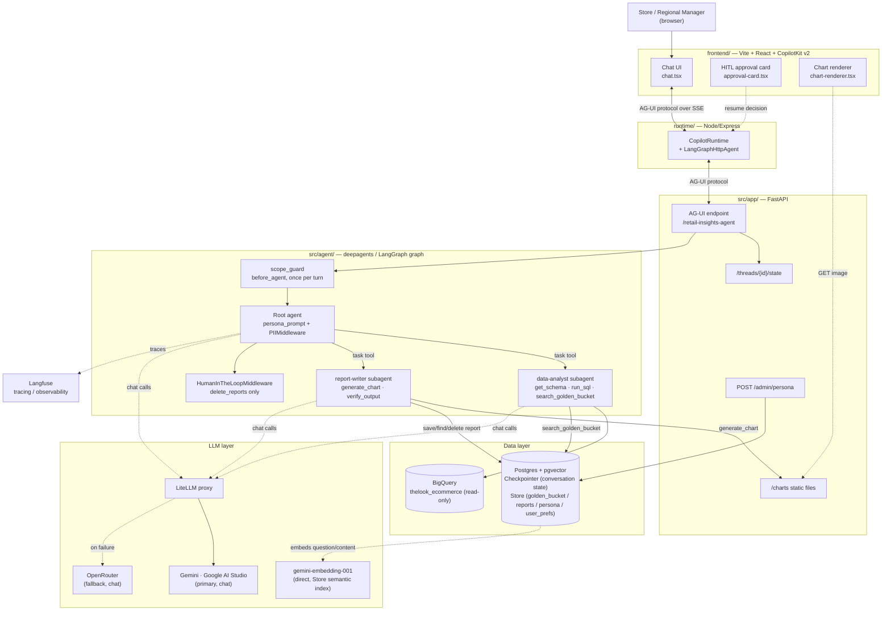

# Retail Insights Agent — High-Level Design

## 0. Scope note: CLI → web UI

The assignment's deliverable #4 asks for a CLI. This build uses a CopilotKit web
chat UI instead, per explicit direction during implementation. This is a **deliberate
deviation**, not an oversight — reasoning:

- A generative-UI chat surface demonstrates two of the graded prototype requirements
  more concretely than a terminal REPL can: the chart-generation extensibility story
  (the assignment's own example of a future capability), and the HITL confirmation
  flow (approve/reject buttons rendered from the same LangGraph interrupt a CLI would
  otherwise print as text).
- It mirrors a real internal pattern (`Revmark_AI`/`Revmark_APP`) rather than a
  bespoke one-off, which matters for "how will this function in production."
- The trade-off: three processes to run instead of one (`Section 7`), and more
  frontend surface area to review. Both are called out explicitly below rather than
  glossed over.

If a CLI is still wanted for grading convenience, `src/agent/agent.py`'s
`build_agent()` is a plain compiled LangGraph graph — a `chat_with_agent.py` REPL
around `agent.ainvoke()`/`Command(resume=...)` is a small addition, not a redesign.

## 1. Architecture Diagram



## 2. Component reasoning

| Component | Choice | Why |
|---|---|---|
| Agent framework | `deepagents` on LangGraph | Supervisor + `SubAgent`s, `interrupt_on` HITL, `Store`-backed memory/skills/backend all come for free instead of hand-rolled. |
| Chat LLM | Gemini (`gemini-flash-latest`) via Google AI Studio, fronted by **LiteLLM proxy** | Matches the assignment's model preference. LiteLLM's real value here is the cross-provider fallback router (see §5) and per-call cost-attribution tags — worth the extra container once there are 2 real providers to fail over between. |
| Chat LLM fallback | OpenRouter (`amazon/nova-2-lite-v1:free`) | Same OpenAI-compatible surface, configured as a LiteLLM `router_settings.fallbacks` entry — one YAML line, no code. |
| Embeddings | Gemini `gemini-embedding-001`, called **directly** (not through LiteLLM) | Embeddings are a distinct API from chat completions; routing them through the chat proxy buys nothing. Called from `postgres_manager.py` only, at Store-construction time. |
| Warehouse | BigQuery, `bigquery-public-data.thelook_ecommerce`, read-only | Given by the assignment. `src/clients/bq_client.py` is the assignment's own reference file, untouched. |
| Durable state | Postgres (`pgvector/pgvector:pg16`) | One database serves three different jobs: LangGraph `AsyncPostgresSaver` (conversation checkpoints), `AsyncPostgresStore` (golden bucket / saved reports / persona / user prefs), and pgvector (semantic search over the Store). Fewer moving parts than a separate vector DB. |
| Orchestration surface | CopilotKit `/v2` + AG-UI protocol | See §0 for why a web UI at all; see §7 for the 3-process shape this implies. |
| Observability | Langfuse | Already scaffolded in the repo; LangChain callback handler attaches per-request with session/user metadata (§8). |

## 3. Data flow (typical question)

1. Manager types a question in the chat UI → CopilotKit runtime → AG-UI POST to
   `/retail-insights-agent` with `configurable.user_id`/`thread_id`.
2. `scope_guard` (once per turn, not per model call) classifies the question. Out of
   scope → canned refusal, graph ends immediately, no further LLM cost. In scope →
   continues.
3. Root agent delegates to **data-analyst**: it calls `search_golden_bucket` (semantic
   search over past Q→SQL→Report trios), then `get_schema` if needed, then `run_sql`.
4. `run_sql` validates the query (`sql_guard.py`: table whitelist, no writes, PII
   columns blocked), checks cost (`cost_guard.py`: BigQuery dry-run byte estimate vs.
   cap), then executes via the untouched `BigQueryRunner`. Errors/empty results loop
   back to the model (bounded — §5).
5. Root agent delegates to **report-writer**: turns the analyst's numbers into a
   report (tone from the live persona — §9), optionally calls `generate_chart`
   (matplotlib → PNG → `charts/`, served by FastAPI's `StaticFiles` mount), then
   self-checks with `verify_output` (LLM-judge) before returning.
6. `PIIMiddleware` scans tool results and the final answer for structural PII
   (email/phone/credit-card/IP) as a backstop — layer 1 already blocked PII *columns*
   at the SQL level; this catches anything that slipped into prose.
7. Response streams back over AG-UI/CopilotKit; charts render as `` via a
   generative-UI tool renderer; Langfuse records the whole run tagged with
   `thread_id`/`user_id`.

## 4. Requirement 1 — Hybrid Intelligence (the Golden Bucket)

**Storage**: `("golden_bucket", "golden"|"candidate")` namespaces in the same Postgres
`Store` used for checkpointing — no separate data lake service. `golden` is the
curated/trusted tier; `candidate` is appended automatically.

**Retrieval at query time**: the Store's native semantic `index` (configured in
`postgres_manager.py` with `GoogleGenerativeAIEmbeddings`, embedding the `question`
field via pgvector) — `search_golden_bucket` calls `store.asearch(ns, query=question)`
ranked by cosine similarity, golden tier checked first, results below a 0.5 similarity
threshold dropped as noise. The `data-analyst` subagent is instructed (its
`golden-bucket-retrieval` skill) to call this before writing SQL from scratch, and to
treat a match as a *template to adapt*, not something to quote verbatim.

**Updating the bucket over time**: after a report is delivered, the system can append
the (question, SQL, report) as a `candidate` trio (`add_candidate_trio` in
`golden_bucket.py`) — the prototype exposes this as a function but doesn't yet wire an
automatic "was this report good?" signal into calling it (see §10, gaps). In
production that signal is: (a) explicit — the user saves the report; (b) implicit — no
follow-up correction to the same question in the same thread. A separate, periodic
batch job (an LLM judge, scoring each `candidate` trio for groundedness and clarity)
promotes high-scoring candidates to `golden` via `promote_to_golden` — kept as a batch
job rather than instant promotion so a bad trio never becomes an exemplar for the very
next question before anyone reviews it.

**Scale note**: at prototype scale (a handful of seed trios) this is already
overkill relative to a keyword filter — it's built this way because embeddings via
Gemini + pgvector cost nothing extra to wire in (§9 in the plan/decision log) and
scale cleanly to a few hundred thousand trios without a re-architecture. Past that,
the natural next step is an ANN index tuned for higher recall (`ivfflat`/`hnsw`
list-count tuning — see the stretch `scripts/tune_embedding_dims.py`), not a different
storage system.

## 5. Requirement 2 — Safety & PII Masking

Two independent layers, deliberately redundant:

1. **`src/safety/sql_guard.py`** (structural, at the SQL level): parses every
   model-generated query with `sqlglot`. Rejects anything that isn't a single
   `SELECT`, rejects tables outside `{orders, order_items, products, users}` (CTE
   aliases excluded from that check), rejects `SELECT *` on `users`, and rejects any
   *direct* reference to `first_name`/`last_name`/`email`/`street_address`/
   `postal_code`/`latitude`/`longitude` — even inside an aggregate like
   `COUNT(email)`, since there's no legitimate analysis reason to touch those columns
   at all. Also clamps/injects a `LIMIT`. This means PII **never enters the LLM's
   context in the first place** — the safest place to stop it.
2. **`langchain.agents.middleware.PIIMiddleware`** (structural, at the text level):
   built-in, not hand-rolled — `email`/`credit_card`/`ip` detectors plus a custom
   phone-number regex, with `apply_to_tool_results=True` and `apply_to_output=True`.
   This is a backstop for PII that isn't column-shaped (e.g. if a customer's email
   somehow appears inside unrelated free text) — names/street addresses aren't
   regex-detectable, so layer 1 is what actually protects those.

**Malicious-user safeguarding**: `scope_guard` (a `before_agent` hook, so it costs
exactly one cheap classifier call per user turn, not per internal tool-calling
iteration) refuses anything outside "analysis questions and saved-report management" —
including requests for a specific customer's raw contact info, requests to run
arbitrary SQL/DDL directly, and prompt-injection attempts (including ones embedded in
quoted text or tool output). The system prompt (`retail_agent_persona.md`) reinforces
the same boundary for defense in depth.

## 6. Requirement 3 — High-Stakes Oversight (Saved Reports)

Reports live in the same Store, namespaced per user (`("reports", user_id)`) — no new
SQL tables. Three tools: `find_reports` (read-only, supports a `this_conversation_only`
filter and semantic "mentioning Client X" search via the same pgvector index),
`save_report`, and `delete_reports`.

`delete_reports` is the one tool wired into deepagents' native
`HumanInTheLoopMiddleware` (`interrupt_on={"delete_reports": {"allowed_decisions":
["approve","reject"]}}`). The **UX-without-breaking-flow** part: the agent's system
prompt requires it call `find_reports` *first* and narrate the concrete matches in
chat, so by the time the interrupt fires, the confirmation the user sees names actual
report ids/titles — never a vague "are you sure you want to delete reports?". On the
web UI, this renders as an `ApprovalCard` with Approve/Reject buttons (no Edit option,
since we only ever allow those two decisions for this tool); a CLI would show the same
structured request as text with a y/n prompt — the mechanism is identical either way,
only the rendering differs.

## 7. Requirement 4 — Continuous Improvement

**User level**: deepagents' native `memory=["/memory/preferences.md"]`, backed by a
`StoreBackend` namespaced by `user_id` (`src/agent/backend.py`). The framework's own
memory-editing tool (`edit_file`) lets the agent record "prefers tables over bullets,"
"wants deep analysis," etc., mid-conversation, and that file is re-injected into every
future turn for that user — no bespoke preference schema to design or maintain.

**System level**: the golden-bucket candidate→golden promotion loop (§4). This is the
system learning *which analyses were good*, distinct from user preference learning
(*how a given manager likes results presented*).

## 8. Requirement 5 — Resilience & Graceful Error Handling

- **SQL self-repair**: `run_sql` counts consecutive `run_sql` failures by scanning the
  turn's own message history (no extra state field — the messages already carry this
  information). After 3 attempts it stops the model from retrying and asks it to
  explain the failure instead — bounded, so a bad query can't silently loop-and-bill
  forever.
- **Empty results**: treated as a `status="error"` ToolMessage with a specific hint
  ("broaden filters / check the date range"), not silently reported as "no data."
- **Cost cap**: `cost_guard.py` dry-runs every query before executing it; anything
  over 500 MB estimated is rejected before it touches BigQuery at all.
- **LLM provider outage**: the LiteLLM proxy's `router_settings.fallbacks` swaps to
  OpenRouter automatically on a Gemini failure — invisible to the agent code.
- **UI never crashes on an agent-side failure**: FastAPI's AG-UI endpoint streams
  `RUN_ERROR` events over the same SSE channel as normal output; CopilotKit renders
  that as a chat-visible error rather than tearing down the page. `onError` in
  `agent-provider.tsx` also logs client-side failures (network drop, runtime down)
  without crashing the React tree.

## 9. Requirement 6 — Quality Assurance

*(Documented; not the prototype's primary implemented requirement — PII/Oversight/
Resilience/Observability were prioritized. See gaps in §10 for what a full pass adds.)*

- **Pre-deployment eval set**: the golden bucket's own seed questions, replayed
  through the agent, scored by an LLM judge for groundedness (same pattern as
  `verify_output`) and compared against the seed reports as a loose rubric — sketched
  as the stretch `scripts/eval_golden.py`.
- **Verifying intent match in production**: `verify_output` runs on *every* final
  report before it's shown to the user (not just in offline eval) — the same judge
  prompt, applied live. A failed verification either gets fixed inline (bounded to 2
  attempts, per the `report-writing` skill) or shipped with a visible caveat, never
  silently.
- **UX evaluation**: track (a) how often a manager immediately follows up with "that's
  not what I meant" / re-asks the same thing rephrased (a proxy for a bad first
  answer), (b) how often `verify_output` fails on the first attempt, (c) which report
  format a manager settles into via their `/memory/preferences.md` file over time.

## 10. Requirement 7 — Observability

**Tracing**: Langfuse's LangChain callback attaches per AG-UI request
(`ag_ui_agent_wrapper.py::prepare_stream`), tagged with `langfuse_session_id=thread_id`
and `langfuse_user_id=user_id` — so a support engineer can pull up *exactly* the
conversation a manager is complaining about, not just "some run around that time."

**Metrics to track at the agent level**:
| Metric | Where it comes from | Why it matters |
|---|---|---|
| `run_sql` failure rate / self-repair-limit hits | `logger.warning` in `run_sql.py` | Rising failures = schema drift, a bad golden-bucket exemplar, or a model regression. |
| `scope_guard` refusal rate + reasons | `logger.warning` in `guard.py` | Spike = either real abuse, or the classifier is too strict and blocking legitimate questions. |
| HITL interrupt rate for `delete_reports` | LangGraph interrupt events, visible in Langfuse | How often destructive intent actually occurs vs. how often it's a false trigger. |
| PII redaction count | `PIIMiddleware`'s own redaction events | Should trend toward zero if layer 1 (SQL guard) is working — a nonzero rate means something is leaking past the column blocklist. |
| Tokens/cost per turn, per model (primary vs. fallback) | LiteLLM's cost-attribution tags + Langfuse | Fallback-usage rate is a leading indicator of a provider outage before anyone notices latency. |
| `verify_output` pass rate on first attempt | Structured judge output | Falling pass rate = report-writer prompt/model regression. |

**Deep-dive debugging**: every metric above is a *trace filter*, not a separate
system — the structured `logger.warning` calls emit the same `thread_id` Langfuse
already has, so "why did this fail" is always "open this thread's trace," never a
log-correlation exercise across systems.

## 11. Requirement 8 — Agility (Persona Management)

Two layers, matching the artifact convention already used for prompts/skills
(`src/artifacts/`, frontmatter markdown + `read_artifact()` — same shape as the
grant-agent reference this repo followed):

- `src/artifacts/prompts/retail_agent_persona.md` — the **versioned default**.
  Redeploy to change it.
- A Store row (`("system","persona")`) — the **live override**. `persona_prompt.py`
  (a `@dynamic_prompt` middleware) reads it every turn through a 60-second in-process
  cache, seeded from the artifact on first read, and **prepends** it to whatever the
  framework/skills/memory middleware already put in the system message — additive,
  so a persona change never wipes out the skills index or loaded memory.
- `POST /admin/persona` (`src/app/main.py`) lets a non-developer overwrite the live
  persona with a single HTTP call — no redeploy, no restart, every process picks up
  the change within 60 seconds. **Left unauthenticated in this prototype** — flagged
  explicitly in the endpoint's own docstring as needing a real admin-role gate before
  production use.

## 12. Setup instructions

Requires: Python 3.12+, [uv](https://docs.astral.sh/uv/), Docker (for Postgres +
LiteLLM), Node.js 20+ (for the web UI), a Google Cloud project with BigQuery API
access (ADC via `gcloud auth application-default login`), a
[Google AI Studio](https://aistudio.google.com/api-keys) API key, and (optional,
fallback provider) an [OpenRouter](https://openrouter.ai/) API key.

```bash
git clone <this-repo> && cd opsfleet-assignment

# 1. Python deps
uv sync

# 2. Env
cp .env.example .env
# edit .env: set GEMINI_API_KEY (required), OPENROUTER_API_KEY (optional fallback)

# 3. Google Cloud auth (BigQuery)
gcloud auth application-default login

# 4. Postgres + LiteLLM proxy
make db-up

# 5. Backend (FastAPI/AG-UI) - runs migrations + seeds the golden bucket on startup
make run          # http://localhost:8000

# 6. CopilotKit runtime (separate terminal)
cd runtime && cp .env.example .env && npm install && npm run dev   # http://localhost:3001

# 7. Frontend (separate terminal)
cd frontend && cp .env.example .env && npm install && npm run dev  # http://localhost:5173
```

Open `http://localhost:5173`, enter any manager id (no auth in this prototype), and
ask something like *"Who are our top 10 customers by total spend?"* or *"Why did our
churn rate spike last month?"*.

**Example run** (via `curl`, no browser needed, useful for grading/CI):

```bash
curl -N http://localhost:8000/retail-insights-agent/health
# {"status": "ok", "agent": {"name": "retail-insights-agent"}}
```

## 13. Known gaps / what a production pass adds

- `scripts/eval_golden.py` and the automatic candidate-trio recording hook (§4) are
  designed but not wired into the live request path — a deliberate scope cut to keep
  the 4 implemented prototype requirements (PII, Oversight, Resilience, Observability)
  solid rather than spreading thinner across all 8.
- `POST /admin/persona` needs real authz before production.
- The web UI's Node runtime skips Revmark_APP's custom thread-rehydration adapter
  (resuming an interrupt after a page refresh) and its `patch-package` patches
  (checked: minor Node-runtime stream-detection/event-ordering fixes) — both
  reasonable to add later, neither blocking for a single-tenant prototype.
- A knowledge graph (e.g. Neo4j GraphRAG) was considered for the golden bucket and
  rejected: it's flat Q&A similarity search, not multi-hop relationship traversal, so
  a graph DB adds a new service/query language for no retrieval benefit here. It
  *would* pull its weight for a future capability — cross-entity root-cause analysis
  (e.g. "which products, suppliers, and regions are all implicated in this quarter's
  return spike") — noted here as a real extensibility path, not a current gap.
