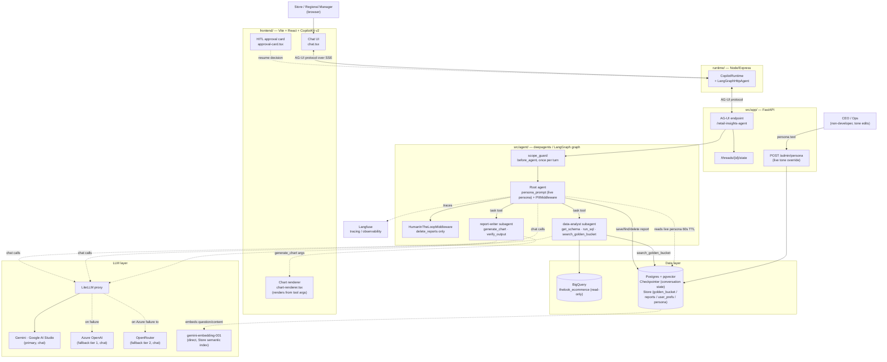

# Retail Insights Agent — High-Level Design

## Model setup note: why LiteLLM sits in front of the models

The assignment asks for a newer Gemini model, so **`gemini-flash-latest` via Google AI
Studio is the configured primary**. In practice its free tier allows ~20 requests/day,
and a single agentic turn here spends several model calls (scope classifier → root
agent → `data-analyst` loop → `report-writer` → `verify_output` judge). A day's quota
is therefore gone after a handful of questions — enough to demonstrate the path, not
enough to develop or test against.

So **most live testing ran on the fallback tier: Azure OpenAI `gpt-5.4`**, where I have
paid credits. That is exactly the swap the **LiteLLM proxy** exists to make free: the
agent code only ever asks for the logical model name `gemini-flash`
(`src/clients/llm_client.py`), and the proxy decides which provider actually serves it
via one line of YAML —

```yaml
router_settings:
  fallbacks: [{"gemini-flash": ["azure-gpt-5.4", "gemini-flash-openrouter"]}]
```

No code change, no redeploy, no per-provider SDK in the app. The same mechanism that
covers a provider outage at runtime (§8) is what made quota-limited development
workable.

That is the general point: with LiteLLM in front, **the whole model layer is
configuration, not code** —

| Change | What it takes |
|---|---|
| Make Azure (or any tier) the primary instead of Gemini | Reorder the `fallbacks` list in `litellm/config.yaml` |
| Add a provider — OpenRouter, Ollama, Bedrock, a self-hosted endpoint | One `model_list` entry with its own credentials |
| Give one agent a different/stronger model than the others | `model:` / `effort:` in that agent's prompt-artifact frontmatter (`src/artifacts/prompts/*.md`) — a markdown edit |
| Rotate a key, change an endpoint or API version | Env vars read by the proxy (`os.environ/...`), never baked into the app |
| A provider rejects a parameter another accepts (e.g. `reasoning_effort`) | `litellm_settings.drop_params: true` drops it instead of failing the attempt |
| Per-model cost and usage attribution | Proxy-side tags, no instrumentation in agent code |

The application only ever knows the string `gemini-flash`.

Consequence worth stating: the behaviour graded here is mostly **GPT-5.4's**, not
Gemini's — the guardrails, prompts, and tool contracts are model-agnostic by
construction, but tone and reasoning depth will shift with whichever tier actually
serves a request. In production the paid tier becomes primary and the free tiers are
dropped entirely (§13).

## 0. Scope note: CLI → web UI

The assignment's deliverable #4 asks for a CLI. This build uses a CopilotKit web
chat UI instead, per explicit direction during implementation. This is a **deliberate
deviation**, not an oversight — reasoning:

- A generative-UI chat surface demonstrates two of the graded prototype requirements
  more concretely than a terminal REPL can: the chart-generation extensibility story
  (the assignment's own example of a future capability), and the HITL confirmation
  flow (approve/reject buttons rendered from the same LangGraph interrupt a CLI would
  otherwise print as text).
- It mirrors a real internal pattern (`Revmark_AI`/`Revmark_APP`) rather than a
  bespoke one-off, which matters for "how will this function in production."
- The trade-off: three processes to run instead of one (`Section 7`), and more
  frontend surface area to review. Both are called out explicitly below rather than
  glossed over.

If a CLI is still wanted for grading convenience, `src/agent/agent.py`'s
`build_agent()` is a plain compiled LangGraph graph — a `chat_with_agent.py` REPL
around `agent.ainvoke()`/`Command(resume=...)` is a small addition, not a redesign.

## 1. Architecture Diagram



## Coverage at a glance: assignment → this document

Three tables mapping every line of the brief to where it's solved. These are the
index; the detail lives in the numbered sections, linked per row.

**Status legend** — ✅ implemented in code, covered by tests · 📐 designed here,
deliberately not coded · ⚠️ deliberate deviation, reasoning given · 🚧 mid-migration.

### Requirements

| # | Requirement | How it's addressed | Detail | Status |
|---|---|---|---|---|
| **1** | **Hybrid Intelligence** — use the Golden Bucket; explain how it updates and how it's retrieved at query time | Trios in `("golden_bucket","golden"\|"candidate")` namespaces of the same Postgres `Store` — no separate lake service. **Retrieval:** pgvector semantic search over the `question` field, golden tier first, sub-0.5 similarity dropped; the analyst's skill forces this call *before* writing SQL and frames a hit as a template to adapt. **Update:** completed analyses append as `candidate`, a batch LLM judge promotes to `golden` — batch, so a bad trio can't become the next question's exemplar. | [§4](#4-requirement-1--hybrid-intelligence-the-golden-bucket) | ✅ retrieval, seeding, promotion<br>📐 auto-capture hook |
| **2** | **Safety & PII Masking** — analysis questions only, hardened against malicious users, never display PII | Three independent layers: `scope_guard` (one classifier call per *user turn*, refuses off-topic / PII-fishing / injection, short-circuits to `end`), `sql_guard` (sqlglot parse: single SELECT, 4-table whitelist, PII columns blocked even inside aggregates — so **PII never enters the LLM context**), and `PIIMiddleware` as a text-level backstop on tool results and final output. | [§5](#5-requirement-2--safety--pii-masking) | ✅ |
| **3** | **High-Stakes Oversight** — strict confirmation for report deletion, without wrecking UX | Reports namespaced per user in the Store. Only `delete_reports` is wired into `HumanInTheLoopMiddleware`; the persona requires `find_reports` first and the interrupt description is built from the actual call args, so the user confirms named reports, never a vague "are you sure?". | [§6](#6-requirement-3--high-stakes-oversight-saved-reports) | ✅ |
| **4.1** | **Learning — user level** (tables vs. bullets, analysis depth, charts vs. text) | deepagents-native `memory=["/memory/preferences.md"]` over a `StoreBackend` namespaced by `user_id`; the framework's own `edit_file` writes preferences mid-conversation and the file is re-injected every future turn. No bespoke preference schema. | [§7](#7-requirement-4--continuous-improvement) | ✅ |
| **4.2** | **Learning — system level** | The candidate→golden promotion loop: the system learns *which analyses were good*, distinct from how a manager likes them presented. | [§7](#7-requirement-4--continuous-improvement) | ✅ mechanism<br>📐 scheduled job |
| **5** | **Resilience** — self-correct, don't crash the UI, don't inflate cost, survive 3rd-party downtime | Bounded SQL self-repair (3 attempts, counted off the message history); empty results returned as an actionable error, not "no data"; 500 MB dry-run cost cap before BigQuery is touched; LiteLLM 3-tier provider fallback; `tool_error_boundary` turning any dead dependency into an error ToolMessage instead of a dead run; timeouts on every third-party call; `RUN_ERROR` streamed to the UI rather than a torn-down page. | [§8](#8-requirement-5--resilience--graceful-error-handling) | ✅ |
| **6** | **Quality Assurance** — pre-deploy eval, intent verification, UX evaluation | `scripts/eval_golden.py` replays seed questions and LLM-judges them against the human reference reports (manual pre-deploy gate); `verify_output` runs the same judge on *every* report live before the user sees it; `docs/TEST_CONVERSATIONS.md` scripts manual E2E per guardrail; 86 unit tests need no external services. | [§9](#9-requirement-6--quality-assurance) | ✅ |
| **7** | **Observability** — know when and why it fails, support deep dives | Langfuse traces tagged `session_id=thread_id` / `user_id`, so a complaint maps to *that exact conversation*; every tool logs `"Agent Called Tool"` with its name; six agent-level metrics defined, each a trace filter rather than a second system to correlate against. | [§10](#10-requirement-7--observability) | ✅ |
| **8** | **Agility** — CEO retunes tone weekly, non-developers, no redeployment | Persona artifact is the versioned default; `POST /admin/persona` writes a live override to the Store which `persona_prompt` picks up within a 60 s TTL — no restart, no deploy. Both **prepend** to the framework's system message, so skills index and loaded memory survive. | [§11](#11-requirement-8--agility-persona-management) | ✅ |

### Deliverables

| # | Deliverable | How it's delivered | Detail | Status |
|---|---|---|---|---|
| **1** | Architecture diagram naming concrete services | Mermaid flowchart with protocol-labeled edges; every block names its actual service — pgvector on the same Postgres, not "a vector DB"; Gemini behind a LiteLLM proxy with a named 3-tier fallback, not "an LLM". | [§1](#1-architecture-diagram) | ✅ |
| **2.1** | Reasoning for services / models / frameworks | Per-component table with the *why*, including what was rejected and why (Neo4j GraphRAG: flat Q&A similarity, not multi-hop traversal). | [§2](#2-component-reasoning), [§13](#13-known-gaps--what-a-production-pass-adds) | ✅ |
| **2.2** | Data flow between components | 7-step trace from keystroke to streamed answer. | [§3](#3-data-flow-typical-question) | ✅ |
| **2.3** | Error handling and fallback strategies | See requirement 5. | [§8](#8-requirement-5--resilience--graceful-error-handling) | ✅ |
| **2.4** | Setup instructions + example run | Prerequisites, 7 steps, plus a browser-free `curl` check for grading. | [§12](#12-setup-instructions) | ✅ |
| **2.5** | Explanation of each requirement | One section per requirement. | [§4](#4-requirement-1--hybrid-intelligence-the-golden-bucket)–[§11](#11-requirement-8--agility-persona-management) | ✅ |
| **3** | Prototype covering **≥2 of 5** listed requirements | **4 of 5 built** — see the sub-table below. | | ✅ 4/5 |
| **4** | CLI interface | ⚠️ Built as a web chat instead — reasoning and the cost of that choice in §0. `build_agent()` returns a plain compiled graph, so a REPL is an addition, not a redesign. | [§0](#0-scope-note-cli--web-ui) | ⚠️ |
| **5** | Runnable on another machine | `uv sync`, `docker compose` for Postgres + LiteLLM, `npm install` for the two Node processes, all behind `make` targets. Only external prerequisites: BigQuery ADC and a Gemini key. | [§12](#12-setup-instructions) | ✅ |
| **6** | Framework of choice | deepagents on LangGraph, FastAPI, CopilotKit/AG-UI, LiteLLM, pytest. | [§2](#2-component-reasoning) | ✅ |

**Deliverable 3 — which of the five prototype requirements are built:**

| Sub-requirement | Built? | Evidence |
|---|---|---|
| 3.1 Safety & PII Masking | ✅ primary | `safety/sql_guard.py`, `middlewares/guard.py`, `middlewares/pii.py`; `tests/test_sql_guard.py`, `tests/test_guard.py` |
| 3.2 High-Stakes Oversight | ✅ primary | `agent.py::INTERRUPT_ON` (args-derived description), `tools/delete_reports.py`; `tests/test_report_tools.py` |
| 3.3 Resilience | ✅ primary | `tools/run_sql.py`, `safety/cost_guard.py`, `middlewares/tool_errors.py`, `litellm/config.yaml`; `tests/test_run_sql.py`, `tests/test_tool_errors.py`, `tests/test_cost_guard.py` |
| 3.4 Quality Assurance | ✅ partial | `tools/verify_output.py`, `scripts/eval_golden.py`, `docs/TEST_CONVERSATIONS.md` — not a primary target |
| 3.5 Observability | ✅ primary | `observability/langfuse.py`, `api/ag_ui_agent_wrapper.py`, per-tool structured logs; `tests/test_langfuse.py` |

### Expected agent capabilities

| Capability | How the agent does it |
|---|---|
| **Customer behavior** (top customers, total spend) | `data-analyst` joins `order_items`→`users` and aggregates `sale_price`. Customers are addressable only by `state`/`city`/`country`/`age`/`gender`/`traffic_source` or opaque id — the SQL guard rejects any query touching name/email/address, so "top customers" returns segments and ids, never a contact list. |
| **Product performance** (compare X vs Y, explain *why*) | Golden-bucket lookup for how analysts framed similar comparisons → `get_schema` → one or more `run_sql` calls → `report-writer` turns the deltas into stated causes and action items, self-checked by `verify_output` for groundedness so no number is invented. |
| **Time-based metrics** (monthly revenue, up-to-date revenue by product) | `datetime_prompt` injects the current date into every model call, so "last month" resolves against today rather than drifting to the model's training cutoff. `get_schema`'s hand-written notes state that revenue lives on `order_items.sale_price` and that `orders` has no amount column, so the model joins instead of inventing one. |
| **Questions about the database's structure** ("what data is available, what can we do with it") | `get_schema` with no arguments returns every table, every column with type/mode/description, PII columns marked `[PII - never select directly]`, plus a hand-written join graph — BigQuery exposes no foreign keys to derive it from, and without it the model invents keys like `users.user_id`. The persona has the root agent answer structure questions directly rather than delegating. |
| **Multi-step queries** ("why did churn spike?", "Q1 report with Q2 action items") | Supervisor pattern: the root agent decomposes and delegates via the `task` tool — `data-analyst` for anything producing numbers, then `report-writer` for synthesis, then root `save_report` on request. Each subagent keeps its own message history, so a five-query investigation doesn't flood the root context. |
| **BigQuery integration with dynamically constructed SQL** | The model writes SQL; `validate_and_prepare_sql` parses it with sqlglot, enforces whitelist and PII blocklist, clamps `LIMIT`, and returns a rewritten query; `cost_guard` dry-runs it; the assignment's own `BigQueryRunner` (`src/clients/bq_client.py`, untouched) executes it. Results come back as a markdown table. |
| **A newer Gemini model** | `gemini-flash-latest` via Google AI Studio, selected per-agent from prompt-artifact frontmatter (`model:` / `effort:`) — swapping models is a markdown edit. OpenRouter is wired as the tier-2 fallback. |
| **The four required tables** | `orders`, `order_items`, `products`, `users` — enforced as `ALLOWED_TABLES` in the guard, not merely requested in a prompt. |

## 2. Component reasoning

| Component | Choice | Why |
|---|---|---|
| Agent framework | `deepagents` on LangGraph | Supervisor + `SubAgent`s, `interrupt_on` HITL, `Store`-backed memory/skills/backend all come for free instead of hand-rolled. |
| Chat LLM | Gemini (`gemini-flash-latest`) via Google AI Studio, fronted by **LiteLLM proxy** | Matches the assignment's model preference. LiteLLM's real value here is the cross-provider fallback router (see §5) and per-call cost-attribution tags — worth the extra container once there are 2 real providers to fail over between. |
| Chat LLM fallback | Azure OpenAI (tier 1, paid/reliable), then OpenRouter free tier (tier 2, last resort) | A single LiteLLM `router_settings.fallbacks` list, tried in order — one YAML line, no code. Two tiers because a single free-tier fallback proved insufficient in practice (see §8): OpenRouter's free models rotate across backend providers with inconsistent tool-schema support, so a paid, single-provider tier goes first. |
| Embeddings | Gemini `gemini-embedding-001`, called **directly** (not through LiteLLM) | Embeddings are a distinct API from chat completions; routing them through the chat proxy buys nothing. Called from `postgres_manager.py` only, at Store-construction time. |
| Warehouse | BigQuery, `bigquery-public-data.thelook_ecommerce`, read-only | Given by the assignment. `src/clients/bq_client.py` is the assignment's own reference file, untouched. |
| Durable state | Postgres (`pgvector/pgvector:pg16`) | One database serves three different jobs: LangGraph `AsyncPostgresSaver` (conversation checkpoints), `AsyncPostgresStore` (golden bucket / saved reports / user prefs), and pgvector (semantic search over the Store). Fewer moving parts than a separate vector DB. |
| Orchestration surface | CopilotKit `/v2` + AG-UI protocol | See §0 for why a web UI at all; see §7 for the 3-process shape this implies. |
| Observability | Langfuse | Already scaffolded in the repo; LangChain callback handler attaches per-request with session/user metadata (§8). |

## 3. Data flow (typical question)

1. Manager types a question in the chat UI → CopilotKit runtime → AG-UI POST to
   `/retail-insights-agent` with `configurable.user_id`/`thread_id`.
2. `scope_guard` (once per turn, not per model call) classifies the question. Out of
   scope → canned refusal, graph ends immediately, no further LLM cost. In scope →
   continues.
3. Root agent delegates to **data-analyst**: it calls `search_golden_bucket` (semantic
   search over past Q→SQL→Report trios), then `get_schema` if needed, then `run_sql`.
4. `run_sql` validates the query (`sql_guard.py`: table whitelist, no writes, PII
   columns blocked), checks cost (`cost_guard.py`: BigQuery dry-run byte estimate vs.
   cap), then executes via the untouched `BigQueryRunner`. Errors/empty results loop
   back to the model (bounded — §5).
5. Root agent delegates to **report-writer**: turns the analyst's numbers into a
   report (tone from the live persona — §11), optionally calls `generate_chart`, then
   self-checks with `verify_output` (LLM-judge) before returning. `generate_chart`
   only *validates* a `ChartArtifact` (chart type, key mappings, 500-point cap) —
   the chart itself is drawn client-side from the same tool arguments, so no image
   is rendered, stored, or served server-side.
6. `PIIMiddleware` scans tool results and the final answer for structural PII
   (email/phone/credit-card/IP) as a backstop — layer 1 already blocked PII *columns*
   at the SQL level; this catches anything that slipped into prose.
7. Response streams back over AG-UI/CopilotKit; the `generate_chart` call's arguments
   stream to a generative-UI tool renderer that draws the chart in the browser;
   Langfuse records the whole run tagged with `thread_id`/`user_id`.

## 4. Requirement 1 — Hybrid Intelligence (the Golden Bucket)

**Storage**: `("golden_bucket", "golden"|"candidate")` namespaces in the same Postgres
`Store` used for checkpointing — no separate data lake service. `golden` is the
curated/trusted tier; `candidate` is appended automatically.

**Retrieval at query time**: the Store's native semantic `index` (configured in
`postgres_manager.py` with `GoogleGenerativeAIEmbeddings`, embedding the `question`
field via pgvector) — `search_golden_bucket` calls `store.asearch(ns, query=question)`
ranked by cosine similarity, golden tier checked first, results below a 0.5 similarity
threshold dropped as noise. The `data-analyst` subagent is instructed (its
`golden-bucket-retrieval` skill) to call this before writing SQL from scratch, and to
treat a match as a *template to adapt*, not something to quote verbatim.

**Updating the bucket over time**: after a report is delivered, the system can append
the (question, SQL, report) as a `candidate` trio (`add_candidate_trio` in
`golden_bucket.py`) — the prototype exposes this as a function but doesn't yet wire an
automatic "was this report good?" signal into calling it (see §10, gaps). In
production that signal is: (a) explicit — the user saves the report; (b) implicit — no
follow-up correction to the same question in the same thread. A separate, periodic
batch job (an LLM judge, scoring each `candidate` trio for groundedness and clarity)
promotes high-scoring candidates to `golden` via `promote_to_golden` — kept as a batch
job rather than instant promotion so a bad trio never becomes an exemplar for the very
next question before anyone reviews it.

**Scale note**: at prototype scale (a handful of seed trios) this is already
overkill relative to a keyword filter — it's built this way because embeddings via
Gemini + pgvector cost nothing extra to wire in (§9 in the plan/decision log) and
scale cleanly to a few hundred thousand trios without a re-architecture. Past that,
the natural next step is an ANN index tuned for higher recall (`ivfflat`/`hnsw`
list-count tuning — see the stretch `scripts/tune_embedding_dims.py`), not a different
storage system.

## 5. Requirement 2 — Safety & PII Masking

Two independent layers, deliberately redundant:

1. **`src/safety/sql_guard.py`** (structural, at the SQL level): parses every
   model-generated query with `sqlglot`. Rejects anything that isn't a single
   `SELECT`, rejects tables outside `{orders, order_items, products, users}` (CTE
   aliases excluded from that check), rejects `SELECT *` on `users`, and rejects any
   *direct* reference to `first_name`/`last_name`/`email`/`street_address`/
   `postal_code`/`latitude`/`longitude` — even inside an aggregate like
   `COUNT(email)`, since there's no legitimate analysis reason to touch those columns
   at all. Also clamps/injects a `LIMIT`. This means PII **never enters the LLM's
   context in the first place** — the safest place to stop it.
2. **`langchain.agents.middleware.PIIMiddleware`** (structural, at the text level):
   built-in, not hand-rolled — `email`/`credit_card`/`ip` detectors plus a custom
   phone-number regex, with `apply_to_tool_results=True` and `apply_to_output=True`.
   This is a backstop for PII that isn't column-shaped (e.g. if a customer's email
   somehow appears inside unrelated free text) — names/street addresses aren't
   regex-detectable, so layer 1 is what actually protects those.

**Malicious-user safeguarding**: `scope_guard` (a `before_agent` hook, so it costs
exactly one cheap classifier call per user turn, not per internal tool-calling
iteration) refuses anything outside "analysis questions and saved-report management" —
including requests for a specific customer's raw contact info, requests to run
arbitrary SQL/DDL directly, and prompt-injection attempts (including ones embedded in
quoted text or tool output). The system prompt (`retail_agent_persona.md`) reinforces
the same boundary for defense in depth.

## 6. Requirement 3 — High-Stakes Oversight (Saved Reports)

Reports live in the same Store, namespaced per user (`("reports", user_id)`) — no new
SQL tables. Four tools: `find_reports` (read-only, supports a `this_conversation_only`
filter and semantic "mentioning Client X" search via the same pgvector index),
`read_report` (opens one report by id and returns its body, so a saved report can be
summarized or built on later — `find_reports` deliberately returns only titles/ids to
keep listings cheap), `save_report`, and `delete_reports`.

`delete_reports` is the one tool wired into deepagents' native
`HumanInTheLoopMiddleware` (`interrupt_on={"delete_reports": {"allowed_decisions":
["approve","reject"]}}`). The **UX-without-breaking-flow** part: the agent's system
prompt requires it call `find_reports` *first* and narrate the concrete matches in
chat, so by the time the interrupt fires, the confirmation the user sees names actual
report ids/titles — never a vague "are you sure you want to delete reports?". On the
web UI, this renders as an `ApprovalCard` with Approve/Reject buttons (no Edit option,
since we only ever allow those two decisions for this tool); a CLI would show the same
structured request as text with a y/n prompt — the mechanism is identical either way,
only the rendering differs.

## 7. Requirement 4 — Continuous Improvement

**User level**: deepagents' native `memory=["/memory/preferences.md"]`, backed by a
`StoreBackend` namespaced by `user_id` (`src/agent/backend.py`). The framework's own
memory-editing tool (`edit_file`) lets the agent record "prefers tables over bullets,"
"wants deep analysis," etc., mid-conversation, and that file is re-injected into every
future turn for that user — no bespoke preference schema to design or maintain.

**System level**: the golden-bucket candidate→golden promotion loop (§4). This is the
system learning *which analyses were good*, distinct from user preference learning
(*how a given manager likes results presented*).

## 8. Requirement 5 — Resilience & Graceful Error Handling

- **SQL self-repair**: `run_sql` counts consecutive `run_sql` failures by scanning the
  turn's own message history (no extra state field — the messages already carry this
  information). After 3 attempts it stops the model from retrying and asks it to
  explain the failure instead — bounded, so a bad query can't silently loop-and-bill
  forever.
- **Empty results**: treated as a `status="error"` ToolMessage with a specific hint
  ("broaden filters / check the date range"), not silently reported as "no data."
- **Cost cap**: `cost_guard.py` dry-runs every query before executing it; anything
  over 500 MB estimated is rejected before it touches BigQuery at all.
- **LLM provider outage**: the LiteLLM proxy's `router_settings.fallbacks` swaps to
  Azure OpenAI, then OpenRouter's free tier, automatically on a Gemini failure —
  invisible to the agent code. `litellm_settings.drop_params: true` keeps a fallback
  provider that doesn't support some param (e.g. `reasoning_effort`) from failing
  the whole fallback attempt over that alone.
- **A single internal classifier/judge call failing must not take the whole run
  down**: `scope_guard` (the safety classifier) and `verify_output` (the report
  judge) both wrap their own model call in a try/except - on any failure (rate
  limit, a malformed response from a flaky free-tier fallback, etc.) they degrade
  rather than propagate: `scope_guard` fails open (lets the request through - the
  SQL/PII layers are separate, still-active defenses regardless), `verify_output`
  returns an error `ToolMessage` the report-writer can react to instead of crashing
  the graph.
- **Any tool hitting a dead dependency degrades instead of killing the run**:
  LangGraph's `ToolNode` only converts `ToolInvocationError` (bad tool args) into a
  `ToolMessage` — every other exception propagates and ends the run. The
  `tool_error_boundary` middleware (`middlewares/tool_errors.py`, registered on the
  root agent and both subagents) wraps every tool call via the framework's own
  `wrap_tool_call` hook and turns a failure — Postgres down, the embeddings API
  rate-limiting a store search, a Store write failing mid-save — into an error
  `ToolMessage` telling the model the failure is transient, not a bad query. One
  middleware rather than a try/except per tool, so it also covers deepagents'
  built-in tools and anything added later.
- **Third-party calls are bounded**: every BigQuery call carries
  `BQ_TIMEOUT_SECONDS` (60s) — `job_timeout_ms` so BigQuery cancels the job
  server-side rather than leaving it running and billing, plus a client-side
  `result(timeout=)`/`get_table(timeout=)` so a hung API call can't hold a chat turn
  open indefinitely. Postgres has `PG_TIMEOUT`, LLM calls have
  `LITELLM_MAX_RETRIES` plus the proxy's fallback chain.
- **UI never crashes on an agent-side failure**: FastAPI's AG-UI endpoint streams
  `RUN_ERROR` events over the same SSE channel as normal output; CopilotKit renders
  that as a chat-visible error rather than tearing down the page. `onError` in
  `agent-provider.tsx` also logs client-side failures (network drop, runtime down)
  without crashing the React tree.

## 9. Requirement 6 — Quality Assurance

*(Documented; not the prototype's primary implemented requirement — PII/Oversight/
Resilience/Observability were prioritized. See gaps in §10 for what a full pass adds.)*

- **Pre-deployment eval set**: the golden bucket's own seed questions, replayed
  through the agent, scored by an LLM judge for groundedness (same pattern as
  `verify_output`) and compared against the seed reports as a loose rubric —
  `scripts/eval_golden.py` (`make eval-golden`; needs Postgres + Gemini + live
  BigQuery, so it's a manual pre-deploy gate, not a pytest suite member).
- **Verifying intent match in production**: `verify_output` runs on *every* final
  report before it's shown to the user (not just in offline eval) — the same judge
  prompt, applied live. A failed verification either gets fixed inline (bounded to 2
  attempts, per the `report-writing` skill) or shipped with a visible caveat, never
  silently.
- **UX evaluation**: track (a) how often a manager immediately follows up with "that's
  not what I meant" / re-asks the same thing rephrased (a proxy for a bad first
  answer), (b) how often `verify_output` fails on the first attempt, (c) which report
  format a manager settles into via their `/memory/preferences.md` file over time.

## 10. Requirement 7 — Observability

**Tracing**: Langfuse's LangChain callback attaches per AG-UI request
(`ag_ui_agent_wrapper.py::prepare_stream`), tagged with `langfuse_session_id=thread_id`
and `langfuse_user_id=user_id` — so a support engineer can pull up *exactly* the
conversation a manager is complaining about, not just "some run around that time."

**Metrics to track at the agent level**:
| Metric | Where it comes from | Why it matters |
|---|---|---|
| `run_sql` failure rate / self-repair-limit hits | `logger.warning` in `run_sql.py` | Rising failures = schema drift, a bad golden-bucket exemplar, or a model regression. |
| `scope_guard` refusal rate + reasons | `logger.warning` in `guard.py` | Spike = either real abuse, or the classifier is too strict and blocking legitimate questions. |
| HITL interrupt rate for `delete_reports` | LangGraph interrupt events, visible in Langfuse | How often destructive intent actually occurs vs. how often it's a false trigger. |
| PII redaction count | `PIIMiddleware`'s own redaction events | Should trend toward zero if layer 1 (SQL guard) is working — a nonzero rate means something is leaking past the column blocklist. |
| Tokens/cost per turn, per model (primary vs. fallback) | LiteLLM's cost-attribution tags + Langfuse | Fallback-usage rate is a leading indicator of a provider outage before anyone notices latency. |
| `verify_output` pass rate on first attempt | Structured judge output | Falling pass rate = report-writer prompt/model regression. |

**Deep-dive debugging**: every metric above is a *trace filter*, not a separate
system — the structured `logger.warning` calls emit the same `thread_id` Langfuse
already has, so "why did this fail" is always "open this thread's trace," never a
log-correlation exercise across systems.

## 11. Requirement 8 — Agility (Persona Management)

Two layers, so the *default* stays versioned in git while the *live* tone is editable
by someone who can't deploy:

- **Versioned default** — `src/artifacts/prompts/retail_agent_persona.md`, matching
  the artifact convention already used for prompts/skills (`src/artifacts/`,
  frontmatter markdown + `read_artifact()`). Its frontmatter also selects the chat
  model and reasoning effort, so swapping models is the same text edit. Changing this
  file needs a deploy — it's the reviewed baseline, not the weekly knob.
- **Live override, no redeploy** — `POST /admin/persona` writes the new text to the
  Store under `("system","persona")`; the `persona_prompt` middleware
  (`@dynamic_prompt`) reads it through a 60-second TTL cache, so every process picks
  up a change within a minute with no restart and no deploy. Absent an override, it
  falls back to the artifact. `set_active_persona` degrades to in-process-only if no
  Store is configured (test mode) rather than crashing.

Both `persona_prompt` and `datetime_prompt` **prepend/append to** whatever the
framework already put in the system message rather than replacing it, so the persona,
skills index, loaded memory, and current-date grounding all coexist.

The cost of the override layer, stated plainly: a second source of truth for the
prompt and a mutation endpoint that is **unauthenticated in this prototype** (flagged
in the endpoint's own docstring). Production gates it behind an admin role and an
audit log — the "non-developers edit tone" requirement is what justifies the endpoint
existing at all; leaving it open is not part of that requirement.

## 12. Setup instructions

Requires: Python 3.12+, [uv](https://docs.astral.sh/uv/), Docker (for Postgres +
LiteLLM), Node.js 20+ (for the web UI), a Google Cloud project with BigQuery API
access (ADC via `gcloud auth application-default login`), a
[Google AI Studio](https://aistudio.google.com/api-keys) API key, and (optional
fallback providers) an Azure OpenAI deployment and/or an
[OpenRouter](https://openrouter.ai/) API key.

```bash
git clone <this-repo> && cd opsfleet-assignment

# 1. Python deps
uv sync

# 2. Env
cp .env.example .env
# edit .env: set GEMINI_API_KEY (required), OPENROUTER_API_KEY (optional fallback)

# 3. Google Cloud auth (BigQuery)
gcloud auth application-default login

# 4. Postgres + LiteLLM proxy
make db-up

# 5. Backend (FastAPI/AG-UI) - runs migrations + seeds the golden bucket on startup
make run-be          # http://localhost:8000

# 6. CopilotKit runtime (separate terminal)
cp runtime/.env.example runtime/.env
make runtime-install && make run-runtime   # http://localhost:3001

# 7. Frontend (separate terminal)
cp frontend/.env.example frontend/.env
make frontend-install && make run-fe       # http://localhost:5173
```

Open `http://localhost:5173`, enter any manager id (no auth in this prototype), and
ask something like *"Who are our top 10 customers by total spend?"* or *"Why did our
churn rate spike last month?"*.

**Example run** (via `curl`, no browser needed, useful for grading/CI):

```bash
curl -N http://localhost:8000/retail-insights-agent/health
# {"status": "ok", "agent": {"name": "retail-insights-agent"}}
```

## 13. Known gaps / what a production pass adds

- The automatic candidate-trio recording hook (§4) is designed but not wired into the
  live request path — a deliberate scope cut to keep the 4 implemented prototype
  requirements (PII, Oversight, Resilience, Observability) solid rather than spreading
  thinner across all 8. `add_candidate_trio`/`promote_to_golden` exist and are tested;
  nothing calls them during a request, and the periodic promotion job is unbuilt.
  `scripts/eval_golden.py` (the offline QA eval) is implemented.
- `POST /admin/persona` (§11) is unauthenticated — acceptable for a single-tenant
  prototype, not for production. Admin role + audit log before it ships.
- The frontend chart renderer is mid-migration (branch `feat/fe-chart-rendering`): the
  backend already emits a validated `ChartArtifact` for client-side rendering, but
  `chart-renderer.tsx` still parses the removed server-rendered PNG path. Remaining
  work is tasks 4–7 of `docs/superpowers/plans/2026-08-07-fe-chart-rendering.md`
  (chart deps + types, the Plotly transform map, the renderer rewrite). Charts are the
  only affected surface; analysis, reports, and the HITL flow are unaffected.
- The web UI's Node runtime skips Revmark_APP's custom thread-rehydration adapter
  (resuming an interrupt after a page refresh) and its `patch-package` patches
  (checked: minor Node-runtime stream-detection/event-ordering fixes) — both
  reasonable to add later, neither blocking for a single-tenant prototype.
- A knowledge graph (e.g. Neo4j GraphRAG) was considered for the golden bucket and
  rejected: it's flat Q&A similarity search, not multi-hop relationship traversal, so
  a graph DB adds a new service/query language for no retrieval benefit here. It
  *would* pull its weight for a future capability — cross-entity root-cause analysis
  (e.g. "which products, suppliers, and regions are all implicated in this quarter's
  return spike") — noted here as a real extensibility path, not a current gap.
- Live testing surfaced that free-tier LLM fallbacks are themselves not fully
  reliable: Gemini's free tier caps at 20 requests/day, and OpenRouter's free
  models are routed across multiple backend providers per request, with
  inconsistent JSON-Schema support for tool-calling (one provider hosting
  `openai/gpt-oss-20b:free` rejected a schema using `anyOf`; a different request to
  the same model slug, hitting a different backend, worked fine). The fallback
  chain now has 3 tiers (Gemini → Azure OpenAI paid/reliable → OpenRouter free
  last-resort) specifically because a single free-tier fallback proved
  insufficient — in production, the middle paid tier would be primary and the free
  tiers dropped entirely.
